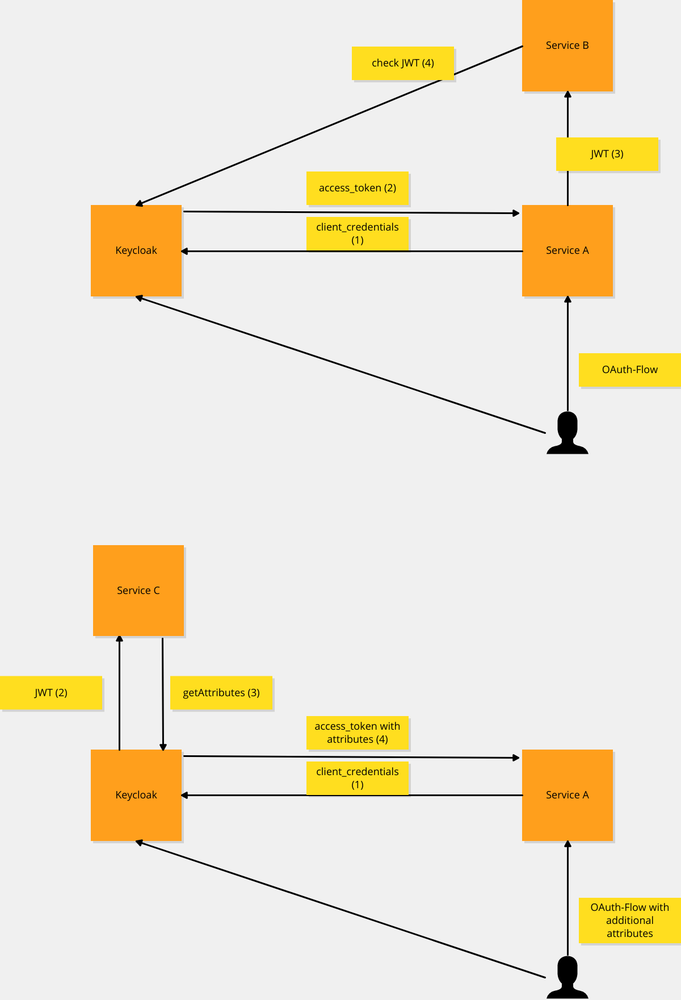

Example Apps for oauth-spring-keycloak-integrations

=== Overview

Ports:

* keycloak - 8080
* ServiceA - 8081
* ServiceB - 8082

=== Start Keycloak and Configure

[source,shell]
----
# start
docker-compose down --remove-orphans && docker-compose up keycloak

# configure
docker run                                              \
  -e KEYCLOAK_URL=http://host.docker.internal:8080/auth \
  -e KEYCLOAK_SSL-VERIFY=true                           \
  -e KEYCLOAK_USER=admin                                \
  -e KEYCLOAK_PASSWORD=admin123                         \
  -e IMPORT_PATH=/config/example-realm.yml              \
  -e IMPORT_FORCE=false                                 \
  -v $PWD/keycloak_config:/config                       \
  --add-host=host.docker.internal:host-gateway          \
  adorsys/keycloak-config-cli:v4.0.1-11.0.3

#
browser localhost:8080/auth/
# admin / admin123

browser http://localhost:8080/auth/realms/example/account
# test / test
----

=== Create Spring Example apps

* Spring Boot CLI - https://docs.spring.io/spring-boot/docs/current/reference/html/cli.html

[source,shell]
----
# using spring cli
# more info: spring init --list
spring init --dependencies=web,thymeleaf,oauth2-client,devtools --package-name de.synyx.cl.oauth.examples.service.a ServiceA
cd ServiceA
# adjust application.yml
mvn spring-boot:run

spring init --dependencies=web,thymeleaf,oauth2-client,devtools,oauth2-resource-server --package-name de.synyx.cl.oauth.examples.service.b ServiceD
cd ServiceB
# adjust application.yml
mvn spring-boot:run
----

=== Client Credentials Grant Flow

----
curl --request POST \
  --url 'http://localhost:8080/auth/realms/example/protocol/openid-connect/token' \
  --header 'content-type: application/x-www-form-urlencoded' \
  --data grant_type=client_credentials \
  --data client_id=service_a \
  --data client_secret=7f7367d1-f394-4a98-af5b-6c11886ff26f \
  --data audience=client_b
----

=== Dependency-Updates (renovate)

* Tutorial: https://github.com/Sebberh/RenovateTutorial
* Options: https://docs.renovatebot.com/configuration-options/

* Klick Configure on: https://github.com/apps/renovate
* Activate
* open Pull Request "Configure Renovate"
* merge the PR
* configure renovate in renovate.json
